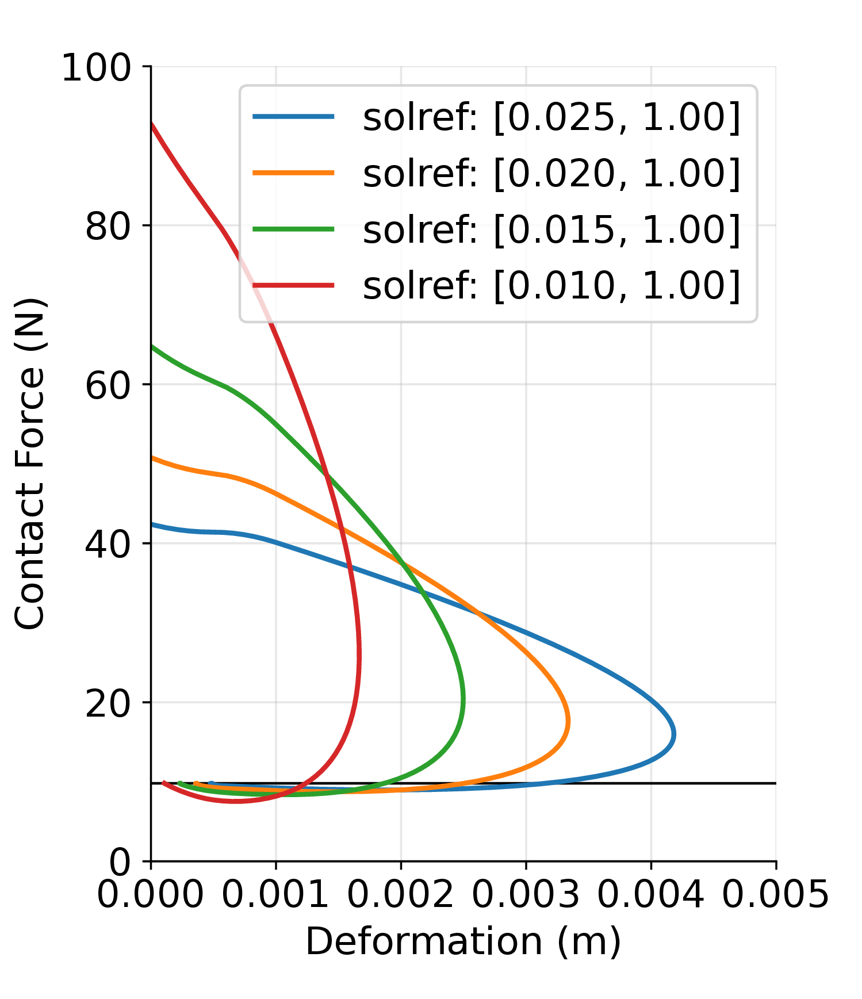
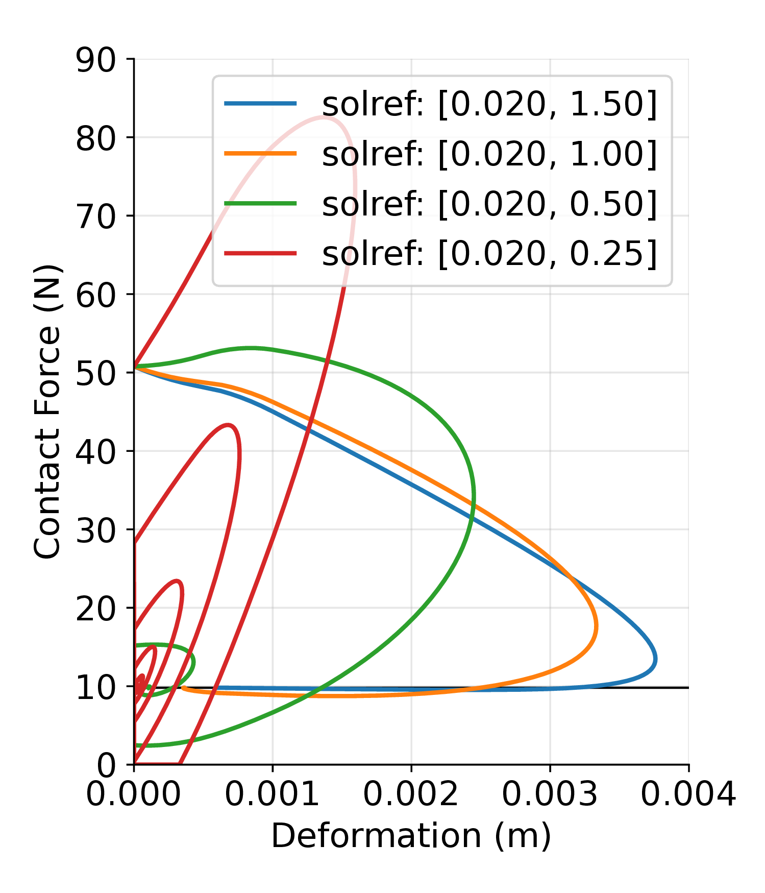
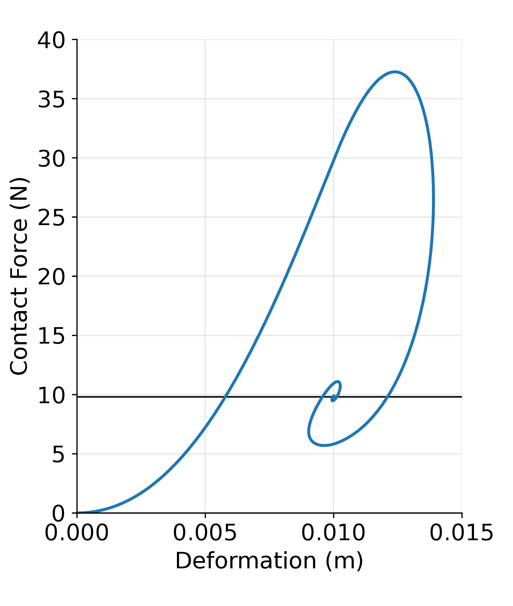

# ContactDyn
Source code of some examples of contact dynamics 
## MuJoCo LQR tutorial

## Sphere Plane Collision
### Default solver parameters

  
  

  <em>Left: Variation in Time constant &nbsp;&nbsp;&nbsp; Right: Variation in Damping ratio</em>

### Modified solver parameters

  

